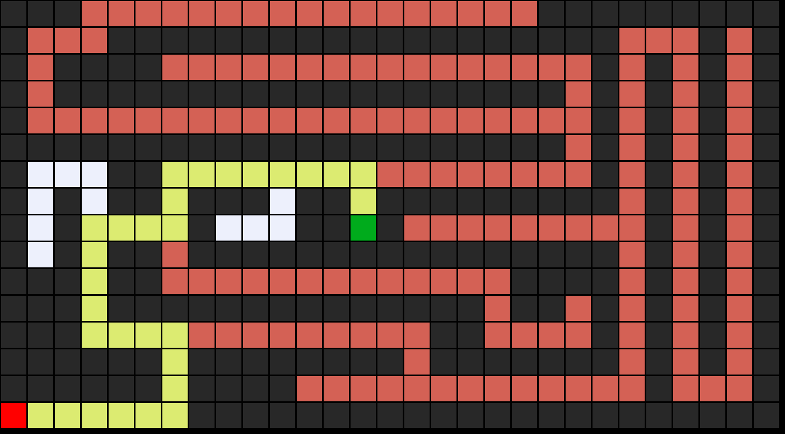

```
<label:Search color:#FFA07A>
```
---


# Maze Solver using DFS/BFS

 

This project implements a maze-solving algorithm using **Depth-First Search (DFS)** by default, with the option to use **Breadth-First Search (BFS)**. The algorithm works on a grid-based maze where the user provides a text file with walls and open spaces, and the program finds the solution (if one exists).

## Classes and Structure

### 1. **Node Class**
Represents a single state (position) in the maze.

```python
class Node():
    def __init__(self, state, parent, action):
        self.state = state
        self.parent = parent
        self.action = action
```

- **state**: Current position in the maze (e.g., `(x, y)` coordinates).
- **parent**: Reference to the parent node from which this node was reached.
- **action**: The move taken to reach this node (e.g., `"up"`, `"down"`).

### 2. **Frontier Class**
This code implements a class for managing the frontier.

```python
class Frontier():
    def __init__(self):
        self.frontier = []
        self.frontier_states = set()

    def add(self, node):
        self.frontier.append(node)

    def contains_state(self, state):
        return state in self.frontier_states

    def empty(self):
        return len(self.frontier) == 0
```
- `add()`: Adds a node to the frontier.
- `contains_state()`: Checks if a state is already in the frontier.
- `remove()`: Removes the last node added (LIFO).

### 3. **StackFrontier Class (DFS)**
Inherits from `Frontier` but uses **LIFO (Last In, First Out)** for **Depth-First Search** (DFS).

```python
    class StackFrontier(Frontier)
        def remove(self):
            if self.empty():
                raise Exception("empty frontier")
            else:
                node = self.frontier[-1]
                self.frontier = self.frontier[:-1]
                return node
```


- **LIFO (Last In, First Out)** behavior.

### 4. **QueueFrontier Class (BFS)**
Inherits from `Frontier` but uses **FIFO (First In, First Out)** for **Breadth-First Search** (BFS).

```python
class QueueFrontier(Frontier):
    def remove(self):
        if self.empty():
            raise Exception("empty frontier")
        else:
            node = self.frontier[0]
            self.frontier = self.frontier[1:]
            return node
```

### 5. **Maze Class**
Handles reading, storing, and solving the maze.

```python
class Maze():
    def __init__(self, filename):
        ...
```

- **Input**: A text file where:
  - `"A"` is the starting point.
  - `"B"` is the goal.
  - `"#"` represents walls.
  - `" "` represents open spaces.
- Reads the maze from the file and processes the layout into a 2D list.

#### 5.1 **Maze Printing**
```python
def print(self):
    ...
```
Prints the maze in a human-readable format:
- `A`: Start position.
- `B`: Goal position.
- `█`: Walls.
- `*`: Solution path (if found).

#### 5.2 **Neighbors Function**
```python
def neighbors(self, state):
    row, col = state
    candidates = [("up", (row - 1, col)), ...]
    ...
```

- **Input**: A state (position).
- **Output**: Valid neighboring positions (e.g., `"up"`, `"down"`, `"left"`, `"right"`).
- Ensures neighbors are within bounds and not blocked by walls.

#### 5.3 **Solve Function**
```python
def solve(self):
    ...

    if use_queue:
            frontier = QueueFrontier()
        else:
            frontier = StackFrontier()
        frontier.add(start)

```

- Implements a maze-solving algorithm using between the `StackFrontier` or `QueueFrontier` as input.
- **Solution**: When the goal is found, the path is constructed by tracing back from the goal to the start using the `parent` nodes.
- **Exploration**: Keeps track of the number of explored nodes (`self.num_explored`).

#### 4.4 **Solution Construction**
```python
if node.state == self.goal:
    ...
```

- When the goal is reached, the solution path is constructed by backtracking from the goal to the start node via the `parent` references.

#### 4.5 **Output Image**
```python
def output_image(self, filename, show_solution=True, show_explored=False):
    from PIL import Image, ImageDraw
    ...
```

- Outputs the maze as a PNG image, marking:
  - Walls as black.
  - Start and goal positions as red and green.
  - Solution path as yellow (if found).
  - Explored nodes as orange (if required).

### 5. **Main Program**
```python
if len(sys.argv) != 3:
    sys.exit("Usage: python maze.py maze.txt")

m = Maze(sys.argv[1], sys.argv[2])
m.solve()
m.output_image("maze.png", show_explored=True)
```

- **Usage**: The program expects a maze file as input via the command line.
- Initializes the maze, solves it, and prints the solution.
- Finally, saves the solved maze as an image (`maze.png`).

## Key Concepts

- **Depth-First Search (DFS)**: Explores as deeply as possible before backtracking. Implemented with `StackFrontier`.
- **Breadth-First Search (BFS)**: Explores all neighbors at the present depth before moving to the next level. Can be implemented with `QueueFrontier` by swapping it with `StackFrontier`.
- **Backtracking**: Once the goal is found, the solution is constructed by tracing back from the goal to the start using the parent nodes.
- **Exploration**: The number of nodes explored is tracked during the solution process.

## Example Usage

To run the program:

```bash
python maze.py maze.txt use_queue = False
```

Where `maze.txt` is a text file representing the maze, with:
- `"A"` as the start,
- `"B"` as the goal,
- Walls represented by `"#"`,
- Open spaces represented by `" "`.

After solving, the maze and its solution will be saved as `maze.png`.

## Dependencies

- **Python 3.x**
- **PIL (Python Imaging Library)**: For creating the maze output image.
  - Install via `pip` or pipenv:

    ```bash
    pip install pillow
    pipenv install pillow
    ```

---

### Example Maze File (`maze.txt`)

```txt
########
# A    #
# ### ##
#      #
## ### #
#    B #
########
```

### Sample Output

```
Maze:
########
#A     #
# ### ##
#      #
## ### #
#    B #
########

Solving...
States Explored: 20
Solution:
########
#A**** #
#*###*##
#*    #
##*### #
#****B #
########
```

This will also generate a `maze.png` file displaying the maze and solution path.

--- 

### Conclution
This README provides an overview of the `maze.py` code, it explains the classes and their functions, as well as instructions for usage and running the program.

